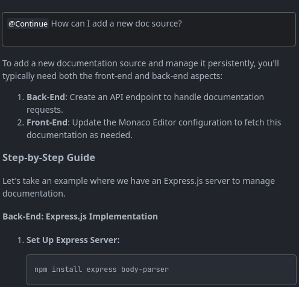
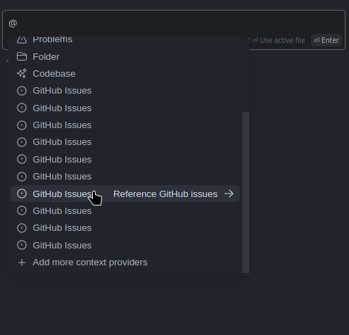

# Continue Take Home Exercise

## Approach
For this exercise, I was interested in two distinct use-cases of Continue: getting started with a new project using Continue, and performing tasks on an existing codebase with Continue. While this was not required in the instructions, it is valuable as these two use-cases result in using the tool differently.

## Getting started
I have also written some notes on the setup process, including troubles I ran into that weren't pointed out in the docs.

I started by installing the extension and configuring how I want to use Continue. After this, I was given a tutorial which I thought was super cool and I haven't seen any other extensions do something like that before.

However, I immediately ran into issues when trying to use the product. These are listed below.
1. **Performance issues** - This seems to only occur when working in a large codebase with many files open. It was noticably slower after installing Continue (even to type!)
2. **Overlapping keybindings** - I use the Vim keybinds extension, and this caused the keybinds in the tutorial to not work. I can quite easily change the keybinds, however with a lot of keybindings it is difficult to find one. It would be neat if a codelens would pop up after highlighting some text with the content of the inline tip (but clickable), though through my research I am not sure how possible this is.
3. **Webview issue** - When initially trying to use the extension I got the following error:
```
Error loading webview: Error: Could not register service workers: TypeError: Failed to register a ServiceWorker for scope
```
There was nothing noted in the docs about this. However, this was fixed after I updated VSCode.

4. **Rate limiting** - After fixing all of the above, I got an error telling me that there were too many requests on each model. I found [this](https://discord.com/channels/1108621136150929458/1219699580719861872) question in the Discord and was able to view more information, but again this was not mentioned in the docs. While adding each and every issue to the docs is infeasible, I think it would be valuable to track the amount of users facing different issues, allowing for common ones to be added to the docs and create a more streamlined setup experience.

After fixing these issues, I was able to proceed with the tutorial, and I was quite impressed with the capabilities. Specifically, I was really impressed with the debugging example, and the fact that the code produced by the Continue output is able to be automatically inserted (something Copilot lacks which is one of my major gripes with that extension).

## [Project from scratch](https://github.com/zaviermiller/continue-takehome/tree/main/rc-playground)
The project I am creating from scratch is a web-based playground for my receipt-components library. This is something I've wanted to implement for a while, and I'm super excited about it. This will help users get their feet wet with the product before installing and using it in their own projects.

### Getting started
I've never done this before, so I used the Continue chat feature to ask for advice:

```
Hello, I am trying to create a web-based playground for a TypeScript library I have created. Is there a particular frontend framework or library I should use to accomplish this?
```

It told me I can use React (or other frontend frameworks) and a library called `monaco-editor` for the code editor. It was also helpful in getting the types and functions into the editor.

### Custom doc sources
I wanted to test adding custom docs for the docs context, so I added the [monaco editor docs](https://microsoft.github.io/monaco-editor/docs.html), but upon trying to use it I got the following error:
```
Error getting context items from docs: TypeError: Tensor.data must be a typed array for numeric tensor
```
It appears to still give an output, and this may be due to my using a source that Continue doesn't know how to parse.

I also noticed that the docs I add are not persisted. This may have been user error, as I didn't spend too much time investigating, but I've listed minimal reproduction steps:
1. Open a new window
2. Add custom docs and give it a name
3. Close the window
4. Reopen the window and try and access the docs.

Keeping these docs stored would be a huge win. In many projects, you usually work with the same set of libraries, so quickly referencing those is paramount to fast development.

It would also be cool if there could be different environments to reduce noise. If I'm working in a Rails project, I can add all of the docs I need to a Rails environment, and only use those. If I then work in a Python project for a client, I could set up an environment with all the docs I need for that.

I also noticed that after using a custom doc source and then trying to go back and ask a question using a different doc source, the custom one is used. Screenshot below.


### What Continue does really well
As I've been working with this, one of the killer features I haven't used before is definitely the ability to have Continue suggest edits, and then apply them to the file all at once. I really like this and it works really well.

I also really like being able to easily chat with Continue about the codebase as a whole. I wasn't initially sure how to execute the code in the playground in a secure environment, and it pointed me in the direction of a sandboxed iframe that works really well.

### Reflection
I now have a simple code editor that users can work in and view their receipts instantly! There is a lot more I would like to do, such as adding better TypeScript support (some autocomplete doesn't work as well as it does in VSCode), allowing multiple files and imports, and the ability to either show the rendered HTML OR the rendered bytes that you can copy and paste and see a receipt actually print.

I, unfortunately, spent way more time than I thought I would on this project, so I wasn't able to get to these features.

Overall, I think using Continue for getting started smooths out the process a lot. It makes it easy to bounce ideas around, and explore different options for implementation and I will definitely be using it for finishing up this project.

## [Existing project](https://github.com/hack4impact-utk/compassion-ministries/tree/2754832f044b6ea99cca64378abd8d4bae6078d7)

For the existing project, I am going to complete a ticket for the Hack4Impact project for Compassion Ministries. The ticket I am working on is [this](https://github.com/hack4impact-utk/compassion-ministries/issues/269) one.

### Adding a context provider
To begin, I wanted to try and use the GitHub issues context provider. To get started I asked Continue how to do this, but it wasn't able to effectively parse the docs and help, so I reverted to reading the docs manually.

It was quite simple to set this up, however after adding the issues context provider, the default context providers were removed.

To fix this I easily used the `config.ts` file to add the context provider instead of setting it directly. However, the TypeScript type `ContextProviderName` is not up to date, so TypeScript showed an error.

Also, pushing in this way shows multiple GitHub Issues context providers (image below), and I am not sure how best to add context providers while keeping the current ones.



Unfortunately, after adding my repo to the settings I was still unable to use the context provider. The `config.ts` is below.

```typescript
export function modifyConfig(config: Config): Config {
  config.contextProviders?.push({
    name: 'issue',
    params: {
      repos: [
        {
          owner: 'hack4impact-utk',
          repo: 'compassion-ministries',
        },
      ],
      githubToken: '<PAT>',
    },
  });
  return config;
}

```
I am probably just doing something wrong, but the docs are unclear.

This setup could be improved by adding a flow within the extension for adding PATs and subsequently adding repos. If this could have a generalized API, that would be awesome for the user experience. Developers could create flows that make it super easy for users to get set up with the custom provider.

### Codebase context provider
The codebase was too large to use the context provider for the entire codebase, however using the open files context provider worked beautifully!

### Using Continue to complete the story
Next I gave it the prompt asking it to just do the story for me, but due to the large filesize directly applying it to the file didn't work. It would be nice if there were some heuristics used to determine if this will happen or not and warn users.

After a manual analysis of the provided code, it did seem like it would work perfectly, so I manually ported it over.

Notably, there are a lot of confirmations happening in this check in process, and it was able to place the new one exactly where the story described it. There is also some complex logic around whether the volunteer exists or not, and Continue was able to deduce that logic and integrate with it perfectly.

### Reflection
Overall, I spent about 30 minutes on this portion (with about 20 of them going towards trying to get set up properly), which is a lot quicker than the average pace these issues get complete on our team.

The PR I opened can be found [here](https://github.com/hack4impact-utk/compassion-ministries/pull/386)

## Summary
All in all, I really like Continue, and I can see the vision of this product. However, there are definitely some things that either don't work or are difficult to get working, and some opportunities to improve the user experience.
